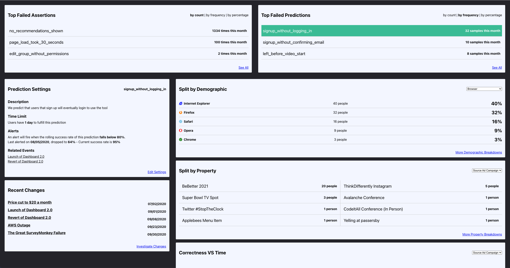

# Client Assertions (Mockup)

I often get frustrated that I don't have enough energy in the day to pursue things I think should exist. I think "that could be cool!" and then proceed to forget about it

For that reason I figured - hey, why not sometimes mockup ideas and give it to other folks who might have that energy/desire?

It's not that I'll never build them. But if I do, I don't particularly mind competition. If I don't, then great - I'd love for it to exist! Go build it, if you like the idea!

Anywho - this is an analytics dashboard based on your failure, insecurities and fears!

Your failure (as a product owner) to predict your users' behavior. Or your failure (as a developer) to understand the states your users might find themselves in. Specifically monitoring and alerting your "sad paths" - _especially_ the ones you never expect users to hit

Why specifically track failures? It makes you think about all the things you don't think should happen. It allows you to be immediately aware of the misconceptions you have about how your users use your product and how business/product changes affect it over time

On the computing side, "number going up is bad" is a very useful thing to know. Rather than "generic numbers" of raw analytics. You can more easily build a focused UX around it!

